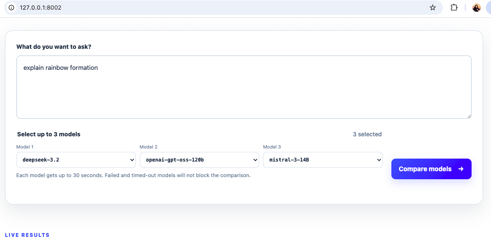
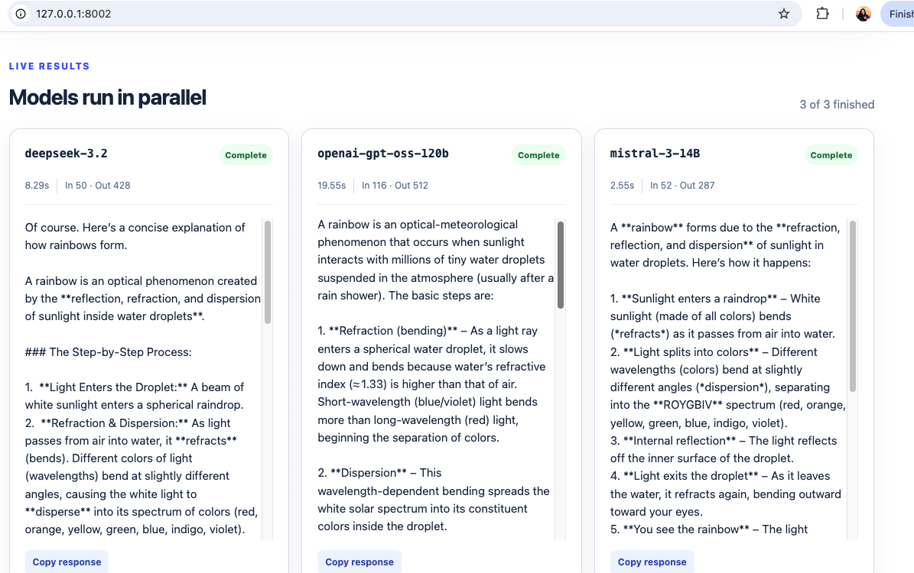
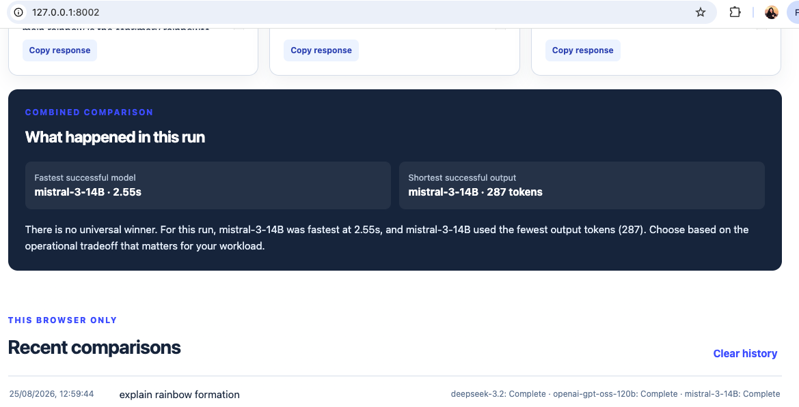
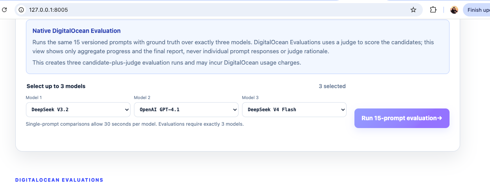
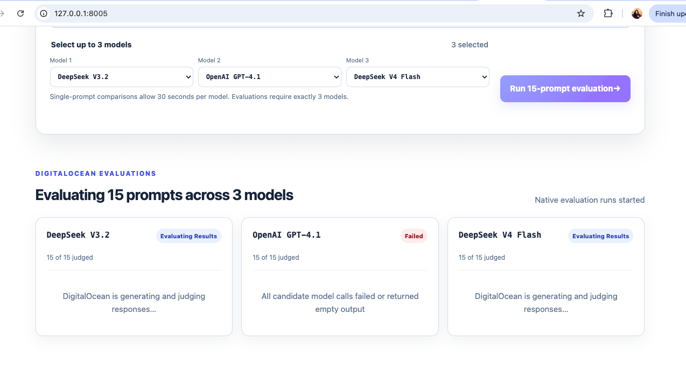
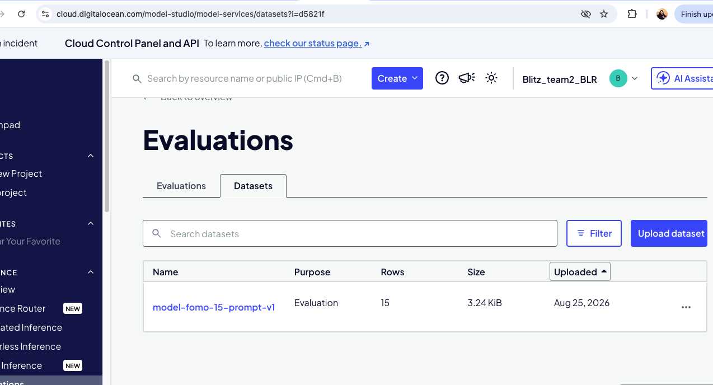
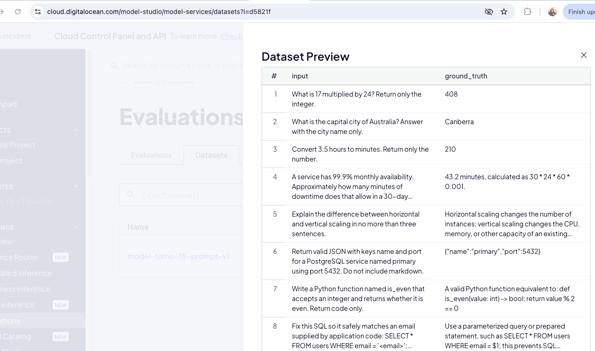
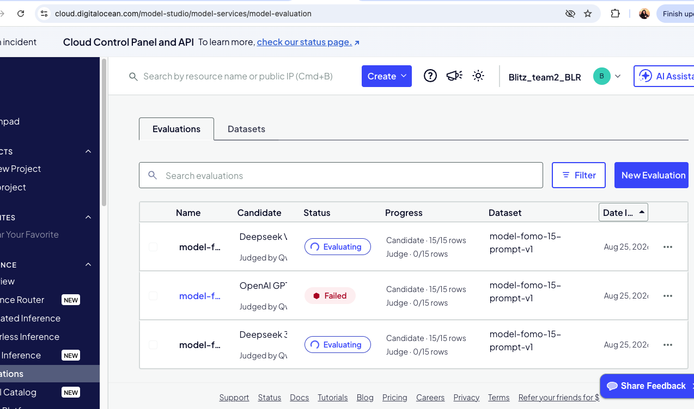

# Model FOMO Comparator

A dependency-free Python proof of concept for choosing up to three models from a
10-model DigitalOcean Serverless Inference catalog. It includes a browser
experience and preserves a scriptable CLI. The default selections remain
`deepseek-3.2`, `kimi-k2.5`, and `qwen3.5-397b-a17b`.

The browser also runs a versioned 15-prompt ground-truth dataset over exactly
three models using native DigitalOcean Evaluations. Evaluation mode hides
individual prompt responses and judge rationale and returns only aggregate
progress and a summarized advisory report.

The dropdown also includes DigitalOcean-hosted access to OpenAI GPT-4.1,
GPT-5 Mini, and GPT-4o Mini. Gemini was not included because it is not currently
returned by DigitalOcean's `/v1/models` catalog for this inference key.

## Two product tracks

The same model selector supports two complementary workflows. Both run exactly
the models selected by the user, keep credentials on the server, and isolate a
failed or slow model from its peers.

| Track | Best for | Work performed | User-visible result |
| --- | --- | --- | --- |
| **1. Single-prompt comparison** | Quickly exploring how up to three models respond to one prompt | Sends the prompt to 1–3 DigitalOcean Serverless Inference models concurrently | A live card per model with answer, status, latency, tokens, and a deterministic operational comparison |
| **2. 15-prompt evaluation** | Comparing exactly three models against a repeatable, versioned test set | Creates three native DigitalOcean Evaluation runs over the same 15 ground-truth prompts | An aggregate report with progress, overall and per-metric results, and an advisory summary; individual answers and judge reasoning stay hidden |

The first track is an interactive inspection tool, not a quality benchmark. The
second adds repeatable quality and safety evidence, but automated evaluation is
still advisory and should be calibrated with human review before production use.

## Track 1 — Single-prompt comparison

Select up to three models from the server-controlled catalog and submit one
prompt with a shared timeout and output budget.



Results appear independently as concurrent requests complete. Each card shows
the normalized status, latency, token usage, response, and copy action.



The combined panel summarizes operational differences without claiming a
universal quality winner. Recent comparison metadata remains in browser-local
storage only.



## Track 2 — Native 15-prompt evaluation

Switch to **15-prompt evaluation**, select exactly three models, and start the
run. The backend evaluates every candidate against the committed
[`evaluation_prompts.jsonl`](evaluation_prompts.jsonl) dataset using DigitalOcean
Evaluations. It shows aggregate progress while the asynchronous runs execute and
then generates one summarized report instead of exposing 45 individual answers.

The evaluation mode explains that it uses a judge, incurs DigitalOcean usage,
and requires exactly three candidates. The same server-controlled model dropdowns
are used in both product tracks, so the browser cannot submit an arbitrary model
or provider endpoint.



After submission, one card represents each native evaluation run. Cards update
with aggregate row progress and status only. A failed candidate is reported on
its own card while the remaining DigitalOcean runs continue; the UI does not
render the 15 individual candidate responses or the evaluator's rationale.



The default metrics are **Correctness** , **Completeness** , **Ground Truth Faithfulness**, **Bias**,
**Toxicity**, and **PII Leakage**. Configure the desired subset with
`DO_EVAL_METRICS`; all selected candidates use the same dataset, judge, metrics,
system prompt, sampling settings, and token budget.

## Run locally

Python 3.10+ is required; there are no third-party packages to install.

1. Create `.env` beside `multi_model_inference.py`:

   ```dotenv
   DO_INFERENCE_API_KEY=your-digitalocean-model-access-key
   # Required only for native DigitalOcean Evaluations:
   DIGITALOCEAN_TOKEN=your-scoped-digitalocean-personal-access-token
   ```

2. Start the web app and open <http://127.0.0.1:8000>:

   ```bash
   python3 multi_model_inference.py --serve
   ```

The key is loaded by Python and used only in the server-to-server authorization
header. It is never included in HTML, browser JavaScript, results, or logs.
`DO_INFERENCE_TIMEOUT` optionally changes the per-model web timeout from 30
seconds. Values are bounded to 1–300 seconds. An HTTP error such as 400 fails that
model immediately; reaching the cutoff marks it Timed out. Neither prevents the
other selected models from completing or the comparison panel from rendering.

The CLI remains available:

```bash
python3 multi_model_inference.py "Explain horizontal pod autoscaling"
python3 multi_model_inference.py "query" --models deepseek-3.2 kimi-k2.5
python3 multi_model_inference.py "query" --json-output results/run.json
```

Validate locally with:

```bash
python3 -m unittest -v
python3 -m py_compile multi_model_inference.py digitalocean_evaluations.py
```

## Backend architecture and end-to-end request flow


```text
Browser
  ├─ POST /api/compare {prompt, 1–3 model IDs}
  │    ├─ concurrent Serverless Inference calls
  │    ├─ partial NDJSON result events
  │    └─ deterministic latency/length comparison
  └─ POST /api/evaluate {exactly 3 model IDs}
       ├─ register/reuse the versioned 15-row dataset
       ├─ 3 asynchronous native DigitalOcean Evaluation runs
       └─ aggregate progress and summarized report only
  │
  ▼
Python API and orchestration layer
  ├─ Track 1 adapter ── DO_INFERENCE_API_KEY ── Serverless Inference
  └─ Track 2 adapter ── DIGITALOCEAN_TOKEN ──── Evaluations control plane
```

### Track 1 request flow

1. `GET /api/config` returns the server-controlled model allow-list, display
   labels, defaults, maximum selection count, and timeout. The client cannot
   submit arbitrary provider URLs or model IDs.
2. `POST /api/compare` validates the request size, prompt, and one-to-three unique
   model IDs before doing billable work. The DigitalOcean key is read from the
   server environment and never crosses the browser boundary.
3. A bounded thread pool starts all selected calls concurrently. Each request has
   the same prompt, system instruction, sampling configuration, output budget,
   and deadline so the operational comparison is explainable.
4. Each task independently maps its outcome to `Complete`, `No final answer`,
   `Failed`, or `Timed out`. An HTTP 400 ends immediately as `Failed`; it is not
   retried. A slow request ends at the configured deadline. Neither blocks valid
   peer results.
5. The API emits one NDJSON event whenever a model finishes. This avoids waiting
   for the slowest model before showing useful work and does not require WebSocket
   infrastructure for a one-directional result stream.
6. After all tasks reach a terminal state, the backend calculates fastest
   successful model and shortest successful output when token usage exists. The
   recommendation uses only status, latency, and output tokens.

### Track 2 request flow

1. `POST /api/evaluate` validates exactly three unique allow-listed model IDs and
   confirms that the committed dataset contains exactly 15 `input` and
   `ground_truth` rows.
2. The backend registers the dataset or reuses `DO_EVAL_DATASET_UUID`, then
   resolves candidate models, the judge model, and `DO_EVAL_METRICS` against
   DigitalOcean's current catalogs.
3. It creates one native evaluation run per candidate with identical evaluation
   inputs and polls the three asynchronous runs until they complete, fail, or
   reach the evaluation deadline.
4. The public response contains only aggregate progress, score, metric summary,
   duration, and normalized status. Per-prompt model output and provider/judge
   reasoning are discarded at the backend boundary.
5. The final report compares this dataset run only. It does not promote the
   highest score as a universally best model.


`multi_model_inference.py` currently combines HTTP transport, orchestration,
DigitalOcean integration, safeguards, and result aggregation.

## DigitalOcean Serverless Inference

The backend sends OpenAI-compatible chat-completion requests to
`https://inference.do-ai.run/v1/chat/completions`. Every selected model receives
the same system instruction, user prompt, temperature, and output-token budget.
Create a model access key in the DigitalOcean Gradient AI Platform, grant it
access to the configured models, and set it as `DO_INFERENCE_API_KEY`.

 Gaurdrail - Prompt checks block likely credentials and excessive input , displayed outputs redact
likely secrets and PII.

## Native 15-prompt DigitalOcean Evaluation

Evaluation mode uses DigitalOcean's control-plane Evaluations APIs rather than
making 45 ordinary chat calls and inventing a local quality score:

1. The backend validates the committed
   [`evaluation_prompts.jsonl`](evaluation_prompts.jsonl) dataset has exactly 15
   `input` and `ground_truth` rows.
2. It reuses `DO_EVAL_DATASET_UUID` when configured. Otherwise it requests a
   presigned upload URL, uploads and registers the dataset, and caches the new
   UUID for the life of the server process.
3. It resolves candidate/judge UUIDs from the DigitalOcean model catalog and
   resolves configured metrics from the evaluation metric catalog.
4. It creates one native evaluation run per candidate against the same dataset,
   judge, metrics, system prompt, sampling settings, and token budget.
5. It polls the asynchronous runs and streams only aggregate status, row progress,
   score, metric summary, and duration. Per-prompt inputs, outputs, and judge
   reasoning are discarded at the backend response boundary.
6. It summarizes the highest aggregate score for this dataset and labels the
   result advisory. Human review is still required before a production decision.

### What is created in DigitalOcean

The first evaluation request uploads and registers the local JSONL as a
DigitalOcean Evaluation dataset named `model-fomo-15-prompt-v1`. The registered
resource contains 15 rows and is visible in **DigitalOcean → Evaluations →
Datasets**. When `DO_EVAL_DATASET_UUID` is configured, the backend reuses that
resource instead of creating another dataset after a server restart.



Each row has an `input` presented to the candidate and a `ground_truth` reference
used by applicable evaluation metrics. Keeping these cases in the versioned
[`evaluation_prompts.jsonl`](evaluation_prompts.jsonl) file makes the test set
reviewable and ensures all three candidates are measured against identical data.



The backend then creates three DigitalOcean Evaluation resources—one for each
selected candidate—with the same dataset, judge model, metrics, system prompt,
sampling configuration, and token budget. DigitalOcean first generates the 15
candidate outputs and then judges them asynchronously. The control panel is the
auditable source for run-level candidate/judge progress and terminal status,
while the PoC polls those resources to build its aggregate report.



The screenshot also demonstrates failure isolation: one candidate run can fail
after its candidate stage without cancelling the other evaluations. Once every
run is terminal, the app reports successful scores and metric summaries alongside
clear failed/timed-out states. It does not silently treat a failed run as a score
of zero or claim that the highest-scoring candidate is universally best.

Native Evaluations requires a separate `DIGITALOCEAN_TOKEN` personal access token
with the necessary GenAI read/create scopes. `DO_INFERENCE_API_KEY` remains the
narrower credential for interactive Serverless Inference. Both remain server-side.
Clicking **Run 15-prompt evaluation** creates three candidate-plus-judge runs and
may incur DigitalOcean usage charges.

### Create the evaluation API token

Create a DigitalOcean personal access token, not another model access key:

1. Sign in to the DigitalOcean Control Panel.
2. Go to **Account → API → Tokens**.
3. Under **Personal access tokens**, click **Generate New Token**.
4. Use a descriptive name such as `model-fomo-evaluations`, choose the shortest
   practical expiration, and select **Custom Scopes**.
5. Grant only the scopes this application needs:

   - `genai:read`
   - `genai:create`
   - `regions:read`
   - `sizes:read`
   - `actions:read`

   `genai:create` requires the four read scopes above. This application does not
   need `genai:update` or `genai:delete` because it does not modify, cancel, or
   delete evaluation resources.
6. Click **Generate Token** and copy the secret immediately. DigitalOcean displays
   it only once.
7. Add it to the local `.env` file:

   ```dotenv
   DO_INFERENCE_API_KEY=your-existing-model-access-key
   DIGITALOCEAN_TOKEN=your-new-personal-access-token
   ```

8. Restart the server so it loads the new environment variable:

   ```bash
   python3 multi_model_inference.py --serve --port 8002
   ```

Never paste either token into chat, browser code, screenshots, logs, or commits.
The `.env` file is ignored by Git. Token scopes cannot be edited after creation;
if DigitalOcean returns HTTP `403`, create a replacement token with the required
scopes. See DigitalOcean's
[personal access token guide](https://docs.digitalocean.com/reference/api/create-personal-access-token/)
and [`genai:create` scope requirements](https://docs.digitalocean.com/reference/api/scopes/genai/create/).

Optional configuration:

```dotenv
DO_EVAL_DATASET_UUID=uuid-of-a-previously-uploaded-dataset
DO_EVAL_JUDGE_MODEL=qwen3.5-397b-a17b
DO_EVAL_METRICS=correctness,completeness
DO_EVAL_TIMEOUT=600
```

After the first successful upload, configuring `DO_EVAL_DATASET_UUID` avoids
registering another copy after a server restart. Runs and datasets remain visible
in the DigitalOcean control panel for auditability; this UI does not delete them.

## Backend design choices and tradeoffs

| Decision | Why it was chosen | Tradeoff and production response |
| --- | --- | --- |
| Server-side DigitalOcean key | Prevents credentials from reaching browser code, history, or exports. | A single key has a large blast radius. Production should use secret-scoped runtime configuration, rotation, tenant authorization, and separate keys/environments. |
| Concurrent bounded fan-out | Reduces comparison wall time from the sum of three calls to approximately the slowest call. | Multiplies token cost and rate-limit pressure. Add admission control, per-tenant concurrency and token budgets, caching, and selective routing. |
| One deadline per model | A slow model cannot hold the whole user experience indefinitely. | A strict cutoff can discard an answer that would have completed. Tune deadlines by workload/model from observed percentiles and support cancellation propagation. |
| Normalized result contract | Keeps provider payload differences out of application and UI logic and prevents reasoning fields from leaking. | Lowest-common-denominator fields can hide useful provider features. Preserve selected metadata in an internal versioned schema while maintaining a strict public allow-list. |
| NDJSON response stream | Works with `fetch`, allows partial cards, and is simpler than bidirectional WebSockets. | Disconnect recovery is limited. Production should assign a comparison ID, persist state, support reconnect/resume, and cancel abandoned work. |
| Shared prompts and settings | Makes latency and length differences easy to explain for one run. | Models have different optimal parameters and context behavior. Store versioned per-model presets and compare them against a controlled baseline. |
| Deterministic comparison | Adds no judge latency/cost and never presents subjective scoring as fact. | It measures operations, not correctness. Quality and safety belong in offline/controlled evaluations plus human review. |
| Native DigitalOcean Evaluations for batch quality | Uses a versioned ground-truth dataset, managed judge workflow, metric catalog, and auditable runs instead of an ad hoc local judge. | Three candidates plus judge scoring add time and cost, and LLM judging remains advisory. Reuse datasets, apply evaluation budgets, gate model support, and calibrate with human review. |
| Local-only history | Delivers useful recents without a database, account model, or retention risk on the server. | It cannot support teams, auditability, cross-device use, or recovery. Production persistence must be opt-in, encrypted, tenant-isolated, and governed by retention policy. |
| Python standard-library server | Keeps setup dependency-free and makes the PoC easy to review. | It is not a production application server. Replace it with a supported framework/runtime, structured middleware, graceful shutdown, connection limits, and load testing. |

## Why there is no universally “best” model

One prompt cannot establish general quality. Results vary by task, language,
context, model version, safety requirements, latency target, and budget. The
fastest answer may be less useful, and the shortest may merely be terse. The app
therefore describes operational differences for this run and leaves answer
quality to the customer rather than presenting an ungrounded leaderboard.

## Longer-term production roadmap

### Phase 1 — Production backend foundation

- Split the code into a stateless API, comparison orchestrator, DigitalOcean
  inference adapter, policy layer, and result aggregator. Package it as a
  container in [DigitalOcean Container Registry](https://docs.digitalocean.com/products/container-registry/)
  and deploy the API and workers on
  [DigitalOcean App Platform](https://docs.digitalocean.com/products/app-platform/).
- Use App Platform readiness/liveness checks against `/healthz`, rolling deploys,
  encrypted runtime secrets, and request- or P95-latency-based autoscaling. Keep
  at least two API instances in production and test graceful shutdown while
  comparisons are active.
- Introduce authenticated tenant/workspace boundaries. Store comparison metadata,
  model policy, audit events, and retention settings in
  [DigitalOcean Managed PostgreSQL](https://docs.digitalocean.com/products/databases/postgresql/).
  Store large customer-approved exports and evaluation datasets in private
  [DigitalOcean Spaces](https://docs.digitalocean.com/products/spaces/) buckets
  with short-lived access.
- Use [DigitalOcean Managed Valkey](https://docs.digitalocean.com/products/databases/valkey/)
  for rate limiting, idempotency keys,
  short-lived result state, cancellation signals, and cache entries. Use TLS,
  trusted sources, and client-side connection pooling; PostgreSQL remains the
  durable source of truth.
- Add per-tenant request, concurrency, token, and daily/monthly spend limits before
  fan-out. Estimate maximum cost at admission time and reject or reduce fan-out
  when a budget cannot cover the run.
- Add explicit total and per-attempt deadlines, client disconnect cancellation,
  circuit breakers per model, and retry only for selected 429/5xx/network errors
  with bounded exponential backoff and jitter.

### Phase 2 — Observability, security, and operational quality

- Generate a comparison ID and child request ID for every model call. Record
  status, model/version, attempts, time to first token, end-to-end latency, input
  and output tokens, estimated cost, and redaction counts—never credentials or
  raw chain-of-thought.
- Send structured App Platform logs to an approved destination, use **App Platform
  alerts** for deployment/scaling failures and CPU/RAM/restarts, and add
  [DigitalOcean Uptime](https://docs.digitalocean.com/products/uptime/) checks for
  public health endpoints. Define SLOs for API
  availability, comparison completion, P95 latency, timeout rate, and result-stream
  reconnect success.
- Add authentication, authorization, CSRF/origin controls, request-size and content
  limits, key rotation, dependency/container scanning, least-privilege network
  access, encryption in transit/at rest, audit trails, and configurable retention.
- Add contract tests against DigitalOcean's model catalog, failure-injection tests,
  concurrency/load tests, timeout/cancellation tests, and disaster-recovery drills.
  Canary releases compare error, latency, and cost signals before full rollout.

### Phase 3 — Evidence-based quality and release gates

- Build versioned [DigitalOcean Evaluations](https://docs.digitalocean.com/products/inference/how-to/evaluate-models/)
  using customer-approved datasets
  split by task, language, risk, and traffic frequency. Measure correctness,
  completeness, groundedness, harmfulness/safety, latency, tokens, and cost.
- Treat automated judging as advisory. Calibrate it with blinded **human review**,
  domain experts for high-impact use cases, inter-rater agreement, and documented
  adjudication. Never expose evaluator chain-of-thought.
- Establish release gates for new models, model versions, prompts, guardrails, and
  routing policies. Block promotion when a star quality/safety metric regresses,
  a critical safety case fails, latency exceeds its SLO, or cost exceeds budget.
  Keep datasets and thresholds versioned so every decision is reproducible.
- Use shadow traffic and canaries with redacted or synthetic inputs before sending
  production traffic to a new configuration. Provide automatic rollback to the
  last known-good model policy.

### Phase 4 — Routing instead of default three-model fan-out

- Feed evaluation and production telemetry into
  [DigitalOcean Inference Router](https://docs.digitalocean.com/products/inference/how-to/use-inference-router/).
  Define workload-specific routes for coding, support, extraction, writing, and
  multilingual tasks, prioritizing optimal quality, cost efficiency, or speed as
  appropriate.
- Start in shadow mode: compare the router's chosen model against the existing
  three-model fan-out and measure routing regret, quality, latency, and cost.
  Promote gradually only after evaluation and human-review gates pass.
- Use single-model routing for routine prompts, fall back to another model on
  bounded retryable failure, and reserve parallel fan-out or human escalation for
  low-confidence, high-risk, or high-value requests. This turns the comparator
  from the steady-state architecture into the evidence-gathering and debugging
  surface for a more efficient production router.

The target production outcome is not a global model leaderboard. It is a
tenant-specific, measurable policy that selects a suitable model for a defined
workload within quality, safety, latency, reliability, and budget constraints.

## Security notes

`.env`, generated reports, caches, and virtual environments
are ignored by Git. Never put the access key in browser code, command output,
screenshots, commits, or exported comparison JSON.
